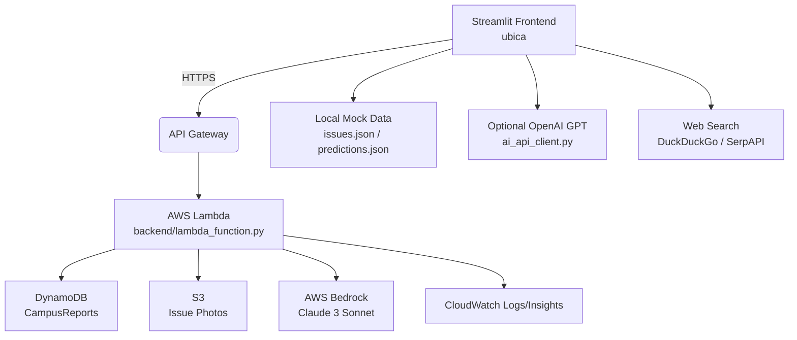

# ubica (CampusFlow) 🏛️

UBica is a campus intelligence copilot: it blends live occupancy data, predictive flow modeling, and conversational GenAI to help students and staff find quiet spaces, report issues, and plan their day. The system leans heavily on AWS managed services (API Gateway, Lambda, DynamoDB, S3, CloudWatch) together with AWS Bedrock (Claude 3) – with optional OpenAI GPT integration for extended answers.

## Features

- 🗺️ **Interactive Campus Map & Wayfinder**
  - Multiple base layers (street, light, dark, satellite)
  - Live legends, building tooltips, and a routing dash to walk between buildings
- 📊 **Real-time Issue Reporting**
  - Streamlit form that writes through API Gateway → Lambda → DynamoDB (mock/local fallback included)
  - Issues are summarized in-app and fed into AI trends
- 🔮 **Predictive Flow Planner**
  - Time-slot forecasts (morning/midday/afternoon/evening) sourced from campus data lake
  - Progress bars, walk times, and amenities to plan ahead
- 🤖 **GenAI Assistant**
  - Default: Local inference with deterministic logic (study spots, accessibility, routing)
  - Optional: AWS Bedrock (Claude 3 Sonnet) or OpenAI GPT for full conversational responses
  - Blends static data, real-time reports, and occupancy predictions when crafting answers
- ♿ **Accessibility Overlay**
  - Wheelchair entrances, elevator counts, accessible washrooms, and guidance notes
- 🛰️ **AWS-Centered Ops**
  - Lambda-backed APIs, S3 media uploads, CloudWatch observability, Bedrock (Claude 3) inference, and DynamoDB persistence

## Architecture

```
┌─────────────────┐
│  Streamlit UI   │
│  (Frontend)     │
└────────┬────────┘
         │
         ▼
┌─────────────────┐
│  API Gateway    │
└────────┬────────┘
         │
         ▼
┌─────────────────┐      ┌──────────────┐
│  Lambda         │─────▶│  DynamoDB    │
│  (Process       │      │  (Storage)   │
│   Reports)      │      └──────────────┘
└────────┬────────┘
         │
         ▼
┌─────────────────┐      ┌───────────────────┐
│  Bedrock        │◀────▶│  S3 / CloudWatch  │
│  (Claude 3)     │      │  (Assets & Logs)  │
└─────────────────┘      └───────────────────┘
```

Optional OpenAI GPT support is provided via the same API client abstraction – drop your `OPENAI_API_KEY` into `.env` and the assistant upgrades automatically.



## Project Structure

```
campusflow/
├── frontend/
│   ├── app.py              # Main Streamlit application
│   ├── map_utils.py        # Map rendering utilities
│   └── api_client.py       # API Gateway client
├── backend/
│   ├── lambda_function.py  # Lambda handler
│   ├── bedrock_client.py   # Bedrock AI integration
│   └── dynamodb_client.py  # DynamoDB operations
├── data/
│   ├── buildings.json      # Building data
│   ├── occupancy.json     # Mock occupancy data
│   └── accessibility.json # Accessibility features
├── infrastructure/
│   ├── deploy.sh          # Deployment script
│   └── terraform/         # Infrastructure as code (optional)
└── requirements.txt
```

## Setup Instructions

### Prerequisites

- Python 3.9+
- AWS Account with access to:
  - Lambda
  - DynamoDB
  - Bedrock (Claude 3 access)
  - API Gateway
- AWS CLI configured with credentials

### Local Development

1. **Clone and install dependencies:**
   ```bash
   pip install -r requirements.txt
   ```

2. **Set up environment variables:**
   ```bash
   cp .env.example .env
   # Edit .env with your AWS credentials and region
   ```

3. **Create DynamoDB table:**
   ```bash
   aws dynamodb create-table \
     --table-name CampusReports \
     --attribute-definitions \
       AttributeName=building,AttributeType=S \
       AttributeName=timestamp,AttributeType=S \
     --key-schema \
       AttributeName=building,KeyType=HASH \
       AttributeName=timestamp,KeyType=RANGE \
     --billing-mode PAY_PER_REQUEST
   ```

4. **Deploy Lambda function:**
   ```bash
   cd backend
   ./deploy.sh
   ```

5. **(Optional) Enable Bedrock or OpenAI:**
   - Bedrock: set `AWS_REGION`, `BEDROCK_MODEL_ID`, and ensure your IAM role has Bedrock access
   - OpenAI: add `OPENAI_API_KEY` to `.env`

6. **Run Streamlit app:**
   ```bash
   streamlit run frontend/app.py
   ```

### AWS Setup

See `infrastructure/README.md` for detailed AWS setup instructions.

## Usage

1. **View Campus Map**: Open the app to see building statuses
2. **Report Issues**: Click "Report Issue" and fill out the form
3. **Plan Ahead**: Use the predictive flow dropdown or ask the chatbot for “evening study spots”
4. **Wayfinder**: Choose a start and end building to plot a walking route
5. **Accessibility**: Toggle the accessibility layer for wheelchair entrances

## License

MIT


